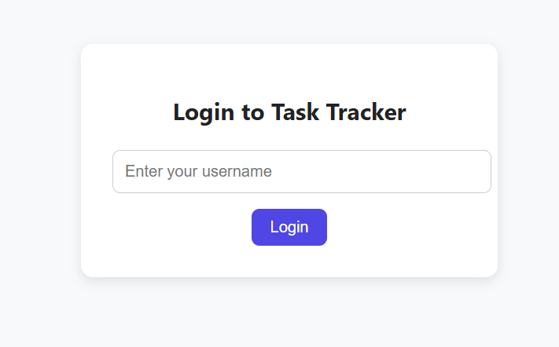
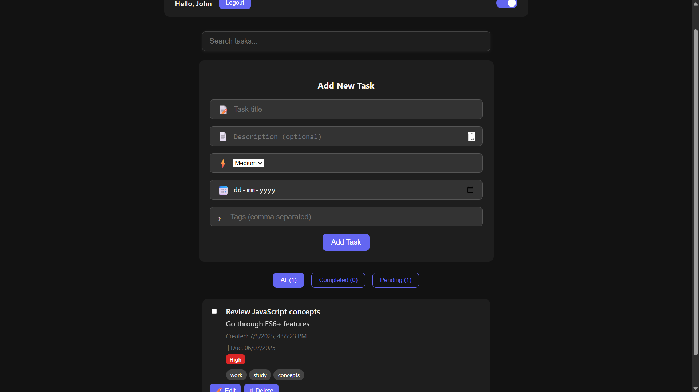

# 📝 Personal Task Tracker

A fully functional and polished personal task tracker built using React.js with user login, dark mode, task filtering, tagging, search, and priority levels.

## 🚀 Features

- User login with localStorage
- Add, edit, delete, and complete tasks
- Task priority (Low, Medium, High)
- Due dates for tasks
- Tagging system with clickable filters
- Search by title or description
- Dark mode toggle with animation
- Per-user task storage in localStorage
- Task filtering (All / Completed / Pending)
- Toast notifications
- Responsive design and clean UI

## 🧰 Technologies Used

- React.js
- React Toastify
- localStorage
- CSS (Dark Mode)
- JavaScript (ES6)

## 📁 Project Structure

```
task-tracker/
├── public/
├── src/
│   ├── components/
│   │   ├── Login.js
│   │   ├── TaskForm.js
│   │   ├── TaskList.js
│   │   ├── TaskItem.js
│   │   └── TaskFilter.js
│   ├── utils/
│   │   └── localStorage.js
│   ├── styles/
│   │   └── App.css
│   ├── App.js
│   └── index.js
├── package.json
└── README.md
```

## 🛠️ Setup Instructions

1. Clone the repository  
   `git clone https://github.com/SaiManas2106/task-tracker.git`  
2. Navigate into the project  
   `cd task-tracker`  
3. Install dependencies  
   `npm install`  
4. Start the development server  
   `npm start`  
5. Open in browser  
   [http://localhost:3000](http://localhost:3000)

## 🔗 Live Demo

([https://task-tracker-f1qcntpmu-sai-manas-projects.vercel.app](https://task-tracker-f1qcntpmu-sai-manas-projects.vercel.app/))

## 🖼️ Screenshots

| Login Screen | Task Dashboard |
|--------------|----------------|
|  |  |

## ✨ Future Scope

- Add backend support (authentication + database)
- Notifications and reminders for due dates
- Drag and drop task reordering
- Multi-user shared task lists
- Upload attachments

## 🧠 Development Steps

1. Initialize React App and structure project
2. Implement Login system using localStorage
3. Build TaskForm, TaskList, and TaskItem
4. Add filtering, priority, tags, and search
5. Apply styling with dark mode and animations
6. Add toast notifications for feedback
7. Finalize with responsiveness and polish
8. Push to GitHub and deploy

## 🧾 License

This project is open-source and free to use.

## 👨‍💻 Author

Built by Sai Manas Masetty  
GitHub: ([https://github.com/SaiManas2106](https://github.com/SaiManas2106))
